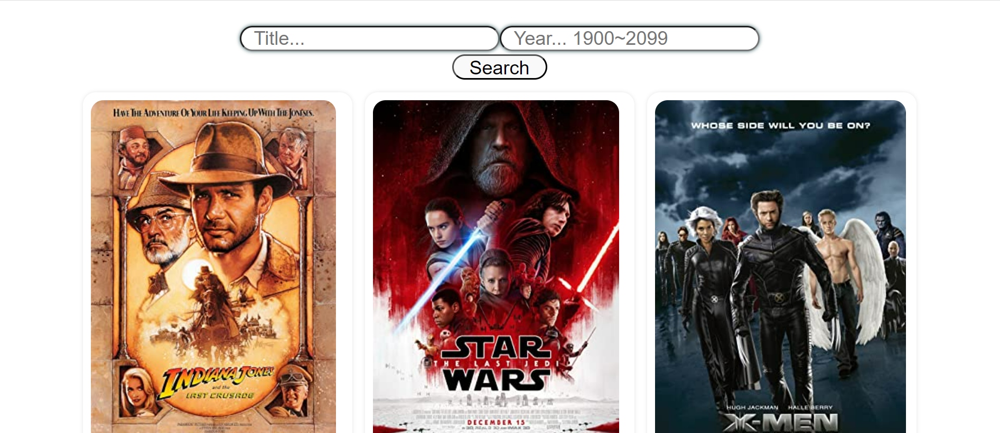

# Movie List

---

## 

This basic React & Typescript project has been created by using vite. You can check the technologies being used below.

## Tables

| Tech         | Description     |
| ------------ | --------------- |
| react-router | to handle page  |
| redux        | to manage state |

## API's

https://www.omdbapi.com/ has been used for getting data. Main page loads with default "the last" title search. Unfortunately there is a problem on api when all data is wanted to fetch.

## How to start

```sh
npm run dev
```
